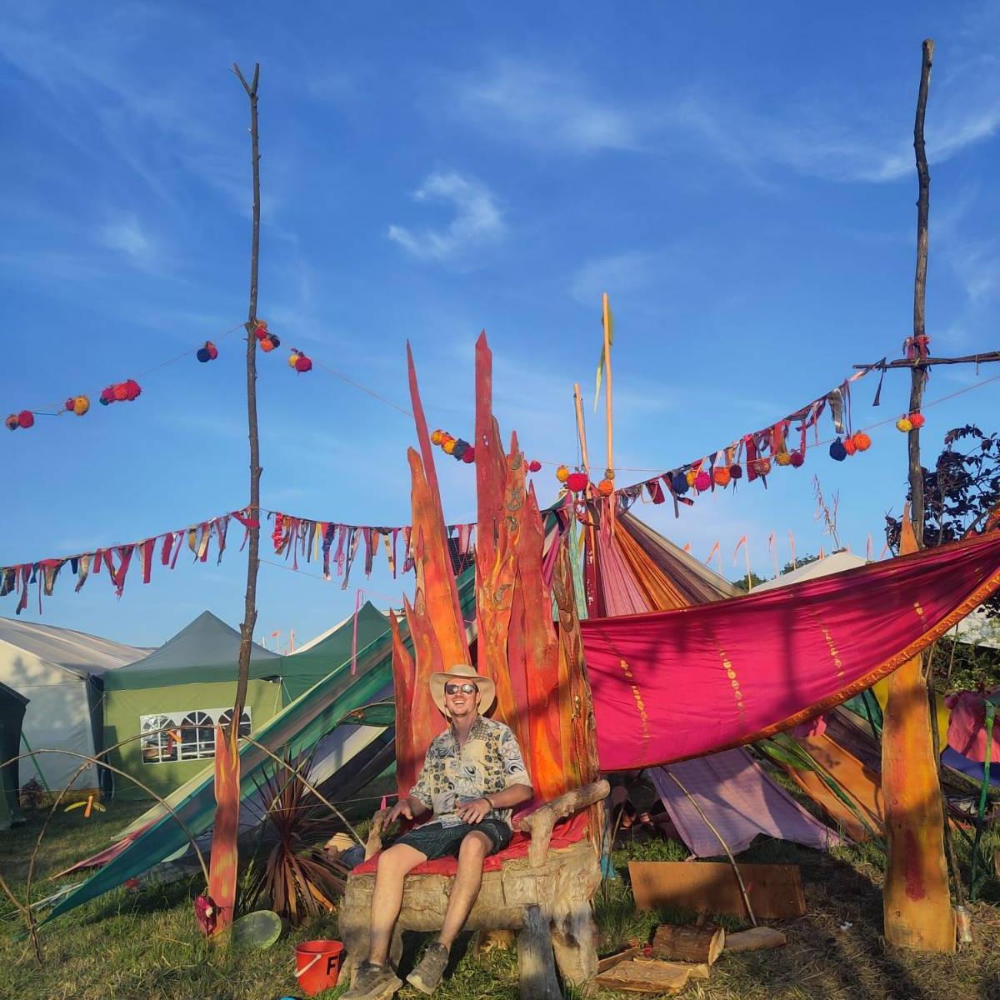
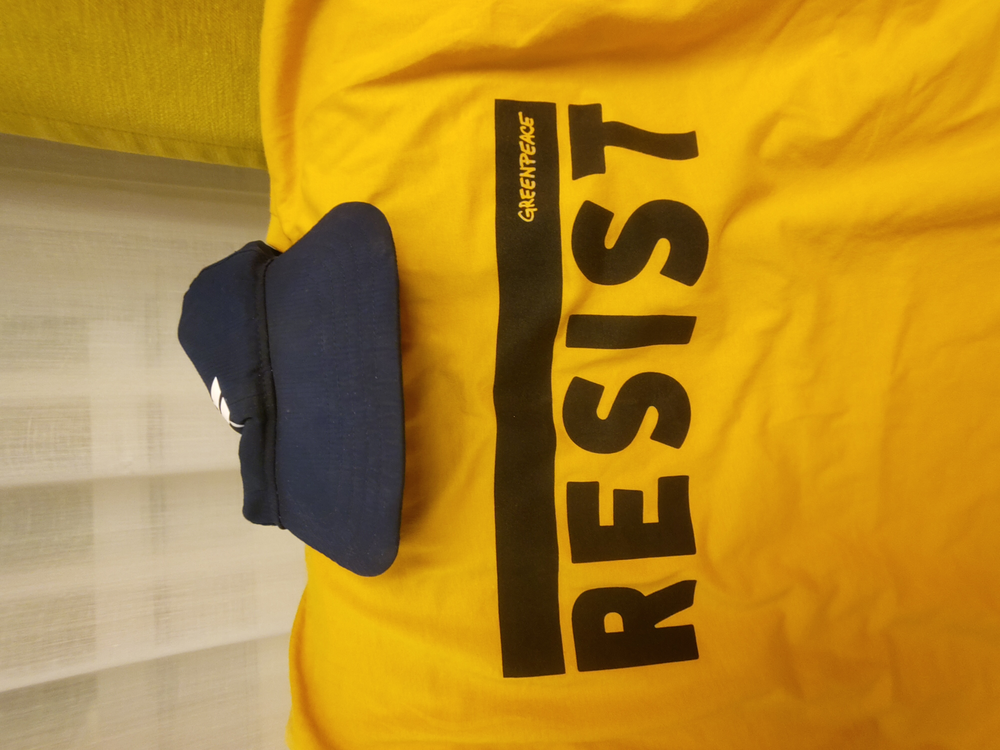

# **On Identity, Memory and Meaning**

Through these words I reflect on what identity means to me, drawing on my understanding of the academic literature, the technological approaches to identification systems and my lived experience creating, sustaining, evolving and even shedding multiple identities over the course of my life. Through these diverse vantage points, I have developed a nuanced view of identity that I do not always see reflected in the conversations and forums I participate in. Identity is complex, necessarily and unavoidably so. While I appreciate the desire to simplify and constrain this complexity, especially when designing digital systems, doing so is simplifying and constraining the complex beings we are identifying. That is, in my opinion, at best a mistake, at worst a grievous harm.

Anyway, let me tell you how I think about identity and how I have come to view it this way.

Recently, I created Words from Wip, this Substack site you are reading now. Through this Substack I have created a common distribution channel for my words that integrates multiple of my distinct, digital presentations of self. It has been fascinating to watch the identities that have formed around these personas, these identifiers that I present my words and thoughts under, over time. To see the influence these identities have had on me as a living being navigating a course into the future. No doubt they have also influenced others who have read some of these words as they have used them to understand their author better, to model his intentions, capabilities and desires. As is only natural, human.

One question I have found myself pondering, that has been brought into sharp focus through the creation of Words from Wip, is which one of these identities is me? 

Am I [Snip](https://snipadvisor.ink), the first, intentionally crafted digital presentation of self and an alias I have been writing under since Kathy and I traveled around [Indonesia in 2017](https://medium.com/wip-around-the-world/canggu-bali-c51249db97da). Snip is a kind and caring friend who appreciates good music played over fine sound systems and enjoys exploring the cultures and natural wonders of the world.

Or perhaps I am [Dr Wip](https://drwip.com). 

My professional, academic presentation of self in the digital realm. Itself an identity that evolved from my presentation as a young, growing software engineer curated at a now historical site - https://wip-abramson.dev.

Or am I Future Wip, my newest, most unformed, experimental presentation of self.

Creating Future Wip, really taught me a lot about crafting and wielding identities and the influence they can have over the future. This started out as a place to put a [piece of writing](https://futurewip.com/crafting-positive-imaginings) I produced that I didn't feel belonged anywhere. Since then, I have published [expressions of rage](https://futurewip.com/they-stole-our-future), [poems of hope and love](https://futurewip.com/dear-earth) and three [short](https://futurewip.com/experiences-in-memory-space), [speculative](https://futurewip.com/memories-of-us) [fictions](https://futurewip.com/quantum-entanglement) that imagine alternative futures. It has been delightful to watch this self take on a life of its own.

So which identity is me?

The truth is, of course, I am all of these and none of them. I contain multitudes, and while these identities I present are presented in rather high fidelity, they are not and could never encapsulate all of who I am, who I was and who I am in the process of becoming. The same is true for every single one of us.

Don't you dare try to put me in your neat little box, label me with a few measly attributes and structure my possibilities for action and interaction on the basis of this boxy, low resolution caricature you insist on calling my identity.

Identities are like a second skin. Or perhaps a cozy jacket. Or maybe it's funky. The point is, you can put it on, you can take it off. You can shed and discard it, leaving it in the realm of the past.

Identities are also guides, they can articulate, not who we are, but who we want to be. Where we are moving towards. In the misty, magical unexplored realm of the future.

Which identities have you crafted to be your guide? What paths are you following?

Or perhaps I should ask whose? If they are not your own, you are doing it wrong.

Identity can be a superpower, it can also be a prison. I have lived both sides of that coin, I am sure most of us have.

Hopefully through of these words, and the words I distribute through Words from Wip, you can get to know me a little deeper, watch me grow and appreciate my complexity. I guarantee you this, each and every one of you reading this will know me differently. Identity is in the eye of the beholder. It emerges moment to moment at the intersection of memory and meaning within an interactive frame.

We contain multitudes. Remember that when you speak to others. Trust that they contain the same multitudes, the same vast, untapped depths as you know yourself to. Of emotion. Of empathy. Of experience. 

Treat them with respect and kindness as you swim about in each other's waters.

Words from Wip is just one representation, of one unique human animal. Sure, it's pretty high fidelity. But it's not complete. Could it ever be?

I considered ending these words here. I mean it makes for a powerful ending. So if you are pressed for time, here is a good place to pause. Thank you for reading these reflections on identity. I hope they resonated with you.

What follows, is a free flowing riff on memory and meaning. Consider this the post script. If you have the time, there are some diamonds in the rough in here.

So what is memory?

To me, memory is a string of moments, of events, meaningfully perceived through the kaleidescope of our unique, lived experience.

This definition clarifies for me the critical importance of shared, mutually experienced moments in space and time. Places like festivals do this. Just look at Glastonbury Festival, a celebration that that has been recurring since 1970 in the same place at roughly the same moment in time (when viewed cyclically). The experiences at this festival, in this magical space, provide a constancy that bridges across time, communities and lives. It brings people together and provides them a commonality through which we can render the other as known, as human. This is immensely powerful.

Memory is transmitted in many mediums, from ephemeral words spoken in conversation, to words written and captured on paper, to the photograph and now the video recording of a moment. Memory encapsulates meaning. Or it attempts to. We remember, because something is meaningful to us. However, transmission of memory is fraught with challenges. Of course. Memory is not the moment. It is the unique, meaningful perception of a moment from the perspective of a single living being. Every time we attempt share, record and transmit memory their is decay, bit loss and interference. In fact this occurs with a one to many effect, where the entity recording or transmitting struggles to encapsulate and convey the meanings they inferred from the remembered moment. Similarly, each being interpreting a transmission or recording of memory, each instance of this interpretation is itself a uniquely experienced moment. Even the same human, inferring meanings from the same recording of a remembered moment, across multiple points in time will experience these moments differently, uniquely. Of course they will, we all know this from our lived experience attempting to navigate and make sense of the worlds we live in.

Humans change, moment to moment, day by day and year by year. We are in a continuous process of becoming, of seeking and also of ossifying. Navigating the tensions inherent in this dichotomy. As all life is. I wouldn't have it any other way. This uncertainty, these unknown and unknowable futures we are moving towards are what makes the magic of living magical. And yes, we should chart our course based on the experiences of the past, both individually and collectively. After all, they are the only maps we have. However, we should also recognize they are not the only maps that have existed, traveling around any of the worlds archaeological wonders will tell you that. Similarly, the maps we do have are by no means accurate and reliable navigation tools for the present moment.

Just like individual living, loving human beings, the world we live in, the societies and cultures we participate in and the technologies we have to interface with the worlds around us are all in a continuous process of becoming. They are in flux. They change. And as they do, so to do the possibilities inherent in these worlds. New actions and interactions, new ways of communicating, organizing and collaborating all become possible. And as they become possible, they become perceivable by a few brave humans with appropriately tuned perceptual lenses willing to step off the map and chart their own course into unknown and unmapped futures. Such bravery is to be applauded and commended, for it is few and far between. And can we be surprised, in a world that, at times, seems so full of hate and suspicion. In a world of vicious competition and horrifying wealth inequality.

Those who do step off the map to brave the unknown and who do not succumb to the pressure to conform to the paths well trodden, may, in time, convince others to journey with them. They may be able to beat down the undergrowth of uncertainty such that the way starts to seem appealing to others. Eventually, some amongst these brave adventures may start to work on maps of their own. Using language and words, they will attempt to paint the contours and texture of these newly discovered worlds of meaning. It is a truly beautiful thing to deeply appreciate the evolution of a thought collective[^1] from the fringes of social acceptability into a widely accepted social phenomena such that we even attempt tune our children's perceptual lenses to these meanings through education[^2]. 

For me, personally, cryptography is one of these awe inspiring thought collectives. Initiated into its modern conception in the 1970s with the likes of Whitfield Diffie, Martin Hellman and Ralf Merkle amongst many others. And of course we should not forget the greats who paved the way for the possibilities of cryptographic thought to be perceived. Computing greats like Ada Lovelace, Alan Turing and Claude Shannon. As well as mathematical giants like Évariste Galois and John Napier. These incredible humans ventured off piste, into the unknown, and it is because of them, and many many more who contributed and continue to sustain and evolve cryptographic thought today that we have a chance of achieving [Security without Identification](https://dl.acm.org/doi/10.1145/4372.4373) in the digital realm. A goal and set of requirements first articulated by another great of the world of crypgography, David Chaum[^3].

I digress. 

You see cryptographic thought is not yet so diffused throughout society that we are attempting to tune our children's perceptual lenses to it. Maybe, hopefully even, one day. Cryptography also has the benefits of being a highly rigorous scientific discipline derived from pure mathematics. In cryptography, like most rigorous scientific disciplines, there is clear agreement on how we can disagree as well as clearly defined assumptions under which the guarantees of this cryptographic protocol or another holds true. This is the exception, not the norm. Would that the world was so simple.

Reality and our unique lived experience of it is for more messy, magical and subjective. The best we can strive for is intersubjectivity - shared understanding about the web of accountabilities that tie us together within an unfolding interaction taking place in space and time. We must also recognize that such a goal is always out of reach, always deferred, because we can never truly know another's subjectivity. The best we can do is guess, estimate and hope. However, it is important to realise that this is more than enough. If we are open, if we reach out to the other with kindness and have grace for our inevitable misunderstandings and misalignments, we can, if only for a moment, meld our minds. Together, we can weave intersubjective tapestries that are more rich, nuanced and beautiful than anything either of us could construct alone[^4].

I do find myself wondering how the technologies I am working with and shaping at the W3C and with Legendary Requirements might and could help with this. I do think they can, but it feels like we are a long ways away from this. I love Joe Andrieu's framing of identity as[ how you recognize, remember and respond to specific people or things](https://functionalidentity.org/). It is a great way to frame it, that directs your focus into to actionable, answerable questions you can interrogate the systems you are developing and interacting with. For me, intersubjectivity is also crucial though. Systems of identification need to understand how they are recognizing, remembering and responding to specific people of things but also and ideally, identified individuals need to understand, intersubjectively with the system and its designers, how they are being recognized, remembered and responded to. And for what purposes. They need to be active participants in the interactions they have with these systems able to shape the way they are recognized, remembered and responded to by a system.

I think one of the ways we can move closer towards this is actually pretty simple:

SIGN ALL THE THINGS

Individuals should be capable of being the source authority over the reality of their digital lives. They should not be treated as merely dumb holders of signed credentials from "trusted" authorities, which they are required to present to other authorities in order to participate in service and get access to resources.

I do not want to live in that world.

I posit that we do not want to live in that world.

As we are seeing clearly around the world today, authorities are trustworthy until they are not. That change from trustworthy to malicious and manipulative. To authoritarian. It can happen fast. In a blink of an eye. It is happening. Now. All around us.

We need to build more robust, more resilient, more decentralized systems for all these reasons and more. Systems of identification are core to most, if not all systems that are useful to us. Useful for making sense of the complex reality we inhabit together. But the goal, the reason d'etre, is not identity, it is making shared sense of this reality so we can chart a course towards more kind, caring, compassionate futures for us all. Or if kind, caring, compassionate futures sound a bit to peace and love for you, what about charting a course to futures that more of us can thrive in.

Identity is a means to an end. We should not lose sight of this!

Let me close by sharing short poem. A wish and an aspiration I hope to push out into the world. Wise words to attempt to live by.

>  Let's live in the present.
>
> Moment to moment.
>
> Try to find it in our hearts to have forgiveness for past wrongs and mistakes.
>
> Let's not let the past be a straight jacket on our futures possibilities.
>
> Our kids futures possibilities.
>
> Instead, let us be open to possibility.
>
> Face uncertainty with a smile.
>
> Have faith that kinder futures are possible.
>
> Take small steps and tiny experiments.
>
> Together.
>
> To bring these futures closer,
>
> To reality.

[^1]: I use thought collectives here as it was defined by Ludwick Fleck in The Genesis and Development of a Scientific Fact. https://plato.stanford.edu/entries/fleck/
[^2]: I think there are interesting,useful analogies to be drawn with the evolution of a thought collective sustaining an idea and the evolution of a star. See Dr Wip's Tour of CERN for some more on this.
[^3]: A more formal(ish) analysis of the evolution and structure of cryptographic thought complete with references etc can be found in the fourth chapter of my [PhD thesis](https://napier-repository.worktribe.com/output/3050571).
[^4]: My thinking on intersubjectivity has been influenced greatly by [Consequences of Language: From Primary to Enhanced Intersubjectivity](https://direct.mit.edu/books/oa-monograph/5499/Consequences-of-LanguageFrom-Primary-to-Enhanced), an incredible book from two researchers working deeply in the realm of language, interaction and meaning.